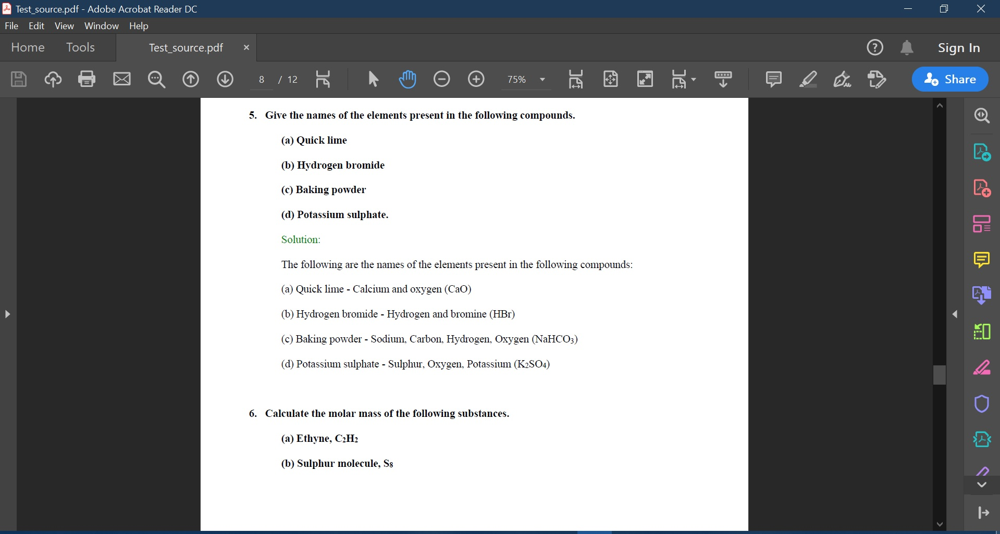
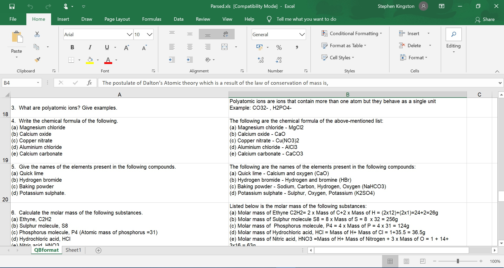

# Python script to extract information from HTML/PDF and save as spreadsheet

Python script to extract text from a HTML/PDF and save the extracted text in an orderly way in an Excel spreadsheet.

In the example program, a set of questions and answers from a question paper are extracted and saved in an Excel file.

The script is designed to parse HTML - if you are going to use a PDF, convert it to HTML first at this [link](https://www.pdftohtml.net/).

## Source


## Output


# Prerequistes
- Install the following libraries required for running the Python script - ```xlwt, xlwd and BeautifulSoup```


    ```
    pip install xlwt xlrd beautifulsoup4
    ```
